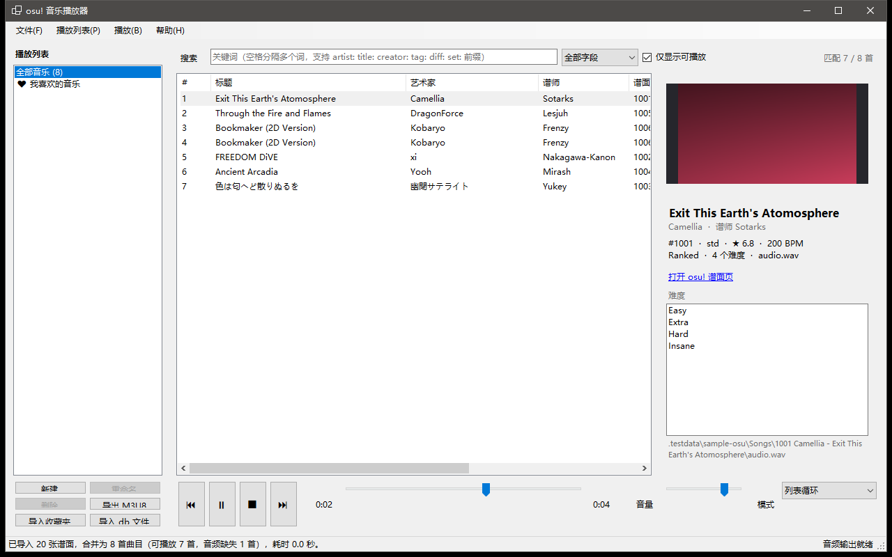

# osu! 音乐播放器（OsuMusicPlayer）

一个**独立于 osu! 客户端的 osu! stable 音乐播放器**。它读取 `osu!.db`，
把**同一个谱面集（mapset）里使用同一段音频的所有难度合并成一首曲目**，
然后像普通音乐播放器一样浏览、搜索、播放、收藏与管理播放列表，
并且可以**把 osu! 收藏夹（collection.db）直接导入成播放列表**。

> 参考项目：[CollectionManager](https://github.com/Piotrekol/CollectionManager)。
> CollectionManager 以“谱面”为表格行（同一谱面集会重复出现多行），本项目的目标正好相反：
> 以“音乐”为单位，一个谱面集只出现一首歌。



---

## 功能

### 1. 合并同一谱面集的音乐
- 读取 osu! stable 的 `osu!.db`（2019-11-05 及以后的版本）。
- 以 `谱面集 ID + 音频文件名` 为键合并难度：
  - `Camellia - Exit This Earth's Atomosphere` 的 4 个难度 → **1 首曲目**；
  - 若同一谱面集的不同难度真的用了不同音频（少见），则各自成为独立曲目；
  - 若 `osu!.db` 记录的音频文件名失效，会自动在谱面文件夹里寻找实际存在的音频文件（`.mp3/.ogg/.wav/.aiff`）。
- 合并后会保留：艺术家 / 标题（罗马字与 Unicode 原文）、谱师、来源、标签、
  难度列表、谱面集 ID、各难度 MD5、BPM、星数、谱面时长、封面等。

### 2. 全库关键词搜索
- 搜索范围：全部字段 / 仅标题 / 仅艺术家 / 仅谱师 / 仅标签 / 仅难度名。
- 多个关键词用空格分隔，**要求全部匹配**；支持：
  - 引号短语：`"exit this earth"`
  - 字段前缀：`artist:` `title:` `creator:` `tag:` `diff:` `set:`
  - 排除：`-camellia`
  - 谱面集 ID 精确匹配：`set:1006`
- 可勾选“仅显示可播放”，隐藏音频文件缺失的曲目。

### 3. 自定义播放列表
- 新建 / 重命名 / 删除 / 清空播放列表；“我喜欢的音乐”为内置收藏列表。
- 支持多选曲目后加入播放列表，或**直接把曲目拖到左侧播放列表上**。
- 播放列表只保存曲目标识，曲目信息始终来自当前音乐库（换 osu! 目录后不会失效；
  已不存在的曲目会在扫描时自动清理）。
- 可把当前列表导出为 **M3U8**，方便在 foobar2000 / VLC 等播放器中打开。

### 4. 导入 osu! 收藏夹为播放列表
- 一键导入 osu! 目录下的 `collection.db`，或从任意 `.db` 收藏夹文件导入。
- 收藏夹里保存的是难度 MD5，导入时会映射回**合并后的曲目**，
  因此一个收藏夹里同一首歌的多个难度只会出现一次。
- 导入报告会显示：每个收藏夹匹配到多少首曲目、有多少张谱面在本地找不到、
  哪些空收藏夹被跳过；同名（同为导入来源）的播放列表会被更新而不是重复创建。

### 5. 播放
- 支持 `mp3` / `ogg` / `wav` / `aiff`（`.ogg` 使用 Vorbis 解码，其余交给 NAudio）。
- 播放模式：顺序播放、列表循环、单曲循环、随机播放（一轮内不重复，跨轮不立刻重复上一首）。
- 上一首 / 下一首 / 停止 / 拖动进度 / 音量；自动跳过损坏或缺失的音频文件并在状态栏提示。
- “正在播放”面板显示封面（读取谱面背景图）、标题、艺术家、谱师、谱面集链接与难度列表。
- 可选“从试听时间点开始播放”；可对当前列表批量分析音频真实时长并缓存。

---

## 环境要求

- Windows 10/11
- [.NET 9 SDK](https://dotnet.microsoft.com/download)（运行已发布的程序只需 .NET 9 桌面运行时）
- 已安装 osu! stable（需要其 `osu!.db`；osu!lazer 的 `client.realm` **不支持**）

## 构建与运行

```powershell
# 构建
dotnet build OsuMusicPlayer.sln

# 运行（首次运行请在“文件 → 选择 osu! 目录…”中指定 osu! 安装目录）
dotnet run --project src\OsuMusicPlayer.App

# 直接指定 osu! 目录启动
dotnet run --project src\OsuMusicPlayer.App -- --osu-dir "C:\osu!"

# 生成一份假的 osu! 目录用于试用（没有安装 osu! 也可以用）
dotnet run --project tools\OsuMusicPlayer.SampleData -- generate .testdata\sample-osu
dotnet run --project src\OsuMusicPlayer.App -- --osu-dir .testdata\sample-osu

# 无界面自检（扫描、搜索、收藏夹导入、播放列表读写、音频解码）
dotnet run --project src\OsuMusicPlayer.App -- --self-test --osu-dir .testdata\sample-osu

# 运行单元测试（83+ 项）
dotnet test OsuMusicPlayer.sln
```

发布单文件版本：

```powershell
dotnet publish src\OsuMusicPlayer.App\OsuMusicPlayer.App.csproj -c Release -r win-x64 `
  --self-contained false -p:PublishSingleFile=true
```

## 使用说明

1. **指定 osu! 目录**：`文件 → 自动检测 osu! 目录`（依次尝试正在运行的 osu!、注册表文件关联、
   常见安装路径），或 `文件 → 选择 osu! 目录…`。目录需要包含 `osu!.db`。
   谱面歌曲目录会从 `osu!<用户名>.cfg` 的 `BeatmapDirectory` 读取，默认是 `<osu!>\Songs`。
2. **搜索**：在搜索框输入关键词，多个词用空格分隔（全部匹配）。`Ctrl+F` 聚焦搜索框。
3. **播放**：双击列表中的曲目即可播放；当前播放队列就是当前显示的列表（搜索结果或播放列表）。
4. **播放列表**：左下角按钮新建/重命名/删除；把中间列表里选中的曲目拖到左侧列表即可加入；
   右键菜单也可以“添加到播放列表”或收藏。
5. **导入收藏夹**：`文件 → 导入 osu! 收藏夹`（读取 osu! 目录下的 `collection.db`），
   或 `文件 → 从 collection.db 文件导入…`。
6. **导出**：`文件 → 导出当前列表为 M3U8…`，或左下角“导出 M3U8”按钮。

### 快捷键

| 快捷键 | 功能 |
| --- | --- |
| `空格` | 播放 / 暂停 |
| `Ctrl+←` / `Ctrl+→` | 上一首 / 下一首 |
| `Enter` | 播放选中曲目 |
| `Delete` | 从当前播放列表移除选中曲目 |
| `Ctrl+F` | 聚焦搜索框 |
| `Ctrl+N` | 新建播放列表 |
| `Ctrl+I` | 导入 osu! 收藏夹 |
| `Ctrl+O` | 选择 osu! 目录 |
| `Ctrl+C`（列表内） | 复制选中的“艺术家 - 标题” |
| `F5` | 重新扫描音乐库 |

### 数据文件

| 文件 | 说明 |
| --- | --- |
| `%AppData%\OsuMusicPlayer\settings.json` | 界面与播放设置（osu! 目录、音量、播放模式、窗口位置等） |
| `%AppData%\OsuMusicPlayer\playlists.json` | 自定义播放列表、收藏与收藏夹导入结果 |
| `%AppData%\OsuMusicPlayer\durations.json` | 音频时长缓存 |
| `%AppData%\OsuMusicPlayer\self-test-report.txt` | 最近一次自检报告 |
| `%AppData%\OsuMusicPlayer\crash.log` | 未处理异常的记录 |

## 项目结构

```
OsuMusicPlayer.sln
├─ src/OsuMusicPlayer.Core        解析与业务逻辑（无 UI 依赖）
│   ├─ IO/                        osu!.db / collection.db 读写、osu! 目录与配置定位
│   ├─ Models/                    谱面、曲目（合并结果）、音乐库、播放列表
│   ├─ Services/                  音乐库构建（合并）、搜索、排序、播放列表存储、
│   │                             收藏夹导入、时长缓存、M3U8 导出
│   └─ Playback/                  播放队列与播放控制器（纯逻辑，可测试）
├─ src/OsuMusicPlayer.Audio       NAudio 播放实现（mp3/ogg/wav，音量、定位、播放结束）
├─ src/OsuMusicPlayer.App         WinForms 界面（中文）
├─ tools/OsuMusicPlayer.SampleData 示例 osu! 目录生成器（osu!.db、collection.db、音频、.osu、背景图）
└─ tests/OsuMusicPlayer.Core.Tests 单元测试
```

### 主要类型

| 类型 | 作用 |
| --- | --- |
| `MusicLibraryBuilder` | 读取 `osu!.db` 并按“谱面集 + 音频”合并为 `MusicTrack` 列表 |
| `MusicTrack` | 一首曲目（合并后的音乐），包含可播放文件路径与所有难度信息 |
| `TrackSearcher` / `TrackSorter` | 关键词搜索与列表排序 |
| `PlaylistStore` | 播放列表增删改查与 JSON 持久化 |
| `CollectionImporter` | 把 `collection.db` 收藏夹导入为播放列表 |
| `PlaybackQueue` / `PlaybackController` | 播放队列、播放模式与自动下一首 |
| `NAudioPlayer` | 基于 NAudio 的音频输出 |

## 自检与诊断

```powershell
# 全流程自检，退出码 0 表示全部通过
OsuMusicPlayer.exe --self-test --osu-dir "C:\osu!"

# 启动后加载音乐库、截图并退出（界面回归验证）
OsuMusicPlayer.exe --screenshot shot.png --osu-dir .testdata\sample-osu
```

## 常见问题

- **能播放 osu!lazer 的音乐吗？** 不能。lazer 使用 Realm 数据库（`client.realm`），
  音频是重命名后的哈希文件；本项目专注于 stable。
- **列表里时长显示 `≈3:15` 是什么意思？** 表示还没有分析真实音频时长，
  显示的是 `osu!.db` 中记录的时间（估算值）。执行“播放 → 分析当前列表时长…”
  后会显示精确时长，并按曲目缓存。
- **有些曲目是灰色的？** 说明该谱面集的音频文件在磁盘上不存在
  （谱面没下全或被手动删除）。它们不会被播放，也不会被自动加入播放列表；
  取消勾选“仅显示可播放”即可看到。
- **`osu!.db` 版本过旧报错？** 先启动一次 osu! stable 客户端让它更新数据库。
- **收藏夹导入后缺少曲目？** 收藏夹里保存的是本地谱面的 MD5；
  如果这些谱面已经不在音乐库里（未下载/已删除），就会计入“本地找不到的谱面”。
- **没有声音 / 提示没有输出设备？** 检查系统默认播放设备；
  无声卡的环境下仍可正常浏览、搜索与管理播放列表。

## 许可

MIT，见 [LICENSE](LICENSE)。`osu!.db` / `collection.db` 的解析参考了
[CollectionManager](https://github.com/Piotrekol/CollectionManager)（MIT，Piotrekol）。
